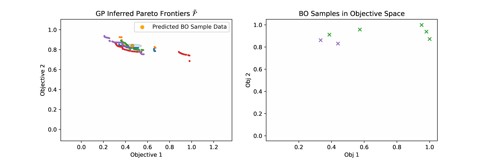

# \{PF\}$^2$ES: A New Acquisition Function for Parallel Feasible Pareto Frontier Entropy Search


### Installation
:exclamation::exclamation::exclamation:Caution: You are away from [the main branch of Trieste](https://github.com/secondmind-labs/trieste), this branch contains certain other functionalities  

install from sources, run
```bash
$ pip install -e.
```
in the repository root (tested with Python version 3.7.11).

### Tutorial/Demonstration Notebook
There is a standalone tutorial notebook `multi_objective_entropy_search_via_PF2ES.py` at ([`\docs\notebooks`](https://github.com/TsingQAQ/trieste/blob/PF2ES_preview_notebook/docs/notebooks/multi_objective_entropy_search_pf2es.pct.py)) demonstrating 
how to make use of the acquisition function for different multi-objective optimization tasks.
 
  
  In order to run the notebook, install the following dependency:     
  ``` 
  $ pip install -r notebooks/requirements.txt
  ```  

  Then, run the notebooks with  
   ```
  $ jupyter-notebook notebooks
  ```
  --------------

### Other info
- [ ] (Comming Soon) The repo capable of running all the experiments.
- For other information-theoretic acquisitions utilized in experimental comparison, please refer their branch:
  - PESMO: https://github.com/HIPS/Spearmint/tree/PESM
  - MESMOC+: https://github.com/fernandezdaniel/Spearmint
  - PPESMOC: https://github.com/EduardoGarrido90/spearmint_ppesmoc
- There is also a backup repo powered by [UGENT SUMO lab](https://sumo.intec.ugent.be/) at [here](https://gitlab.ilabt.imec.be/sumolab/trieste/-/tree/PF2ES_preview_notebook).  

### Citation
If you find this work or repository helpful, please kindly consider citing our work:
```
@article{qing2022pf2es,
  title={PF2ES: Parallel feasible Pareto frontier entropy search for multi-objective Bayesian optimization under unknown constraints},
  author={Qing, Jixiang and Moss, Henry B and Dhaene, Tom and Couckuyt, Ivo},
  journal={ArXiv, abs/2204.05411},
  year={2022}
}
```

  